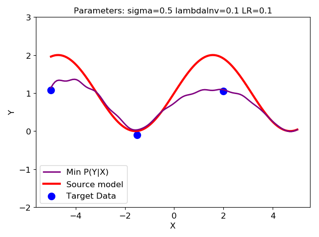

# CDMpytorch
Transfer learning for regression based on conditional distribution matching

Pytorch implementation of [Active transfer learning under model shift](http://www.jmlr.org/proceedings/papers/v32/wangi14.pdf) for regression transfer. 

## Getting Started
### Demon
- LS_minPYX.py is the curve demon. Given the source model and few targe data, the predicted target model of CDM will be given.
